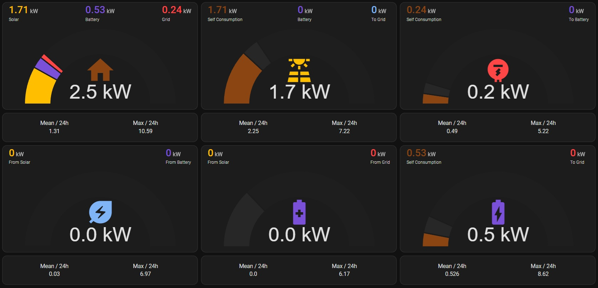

# Home-Assistant-Power-Flow-Gauges
Visualize instant power consumption and generation divided by categories.
Tested on Sigenergy in all modes, including Ai.

The included gauges are:
- Consumption
- Solar production
- Grid import
- Grid export
- Battery charge
- Battery discharge

## Pre-requirements

This has not been tested on HA earlier than 2024.9 and requires the following HACS addons:

- Apex-Charts card - For the gauges.
- lovelace-card-mod - For adding the icons instead of regular text.

## Installation
- Install the required HACS addons above, if not already installed.
- Copy the HA automation and fields file `power_flow_gauges_sigen.yaml` for Sigenergy systems to your `packages` directory. (Other EnergyStorageSystems may become available later.). If you don't have such a directory, look at the [Sigenergy installation instructions](https://github.com/TypQxQ/Sigenergy-Home-Assistant-Integration/wiki/2.-How%E2%80%90to%E2%80%90install) on how to make one.
- Restart Home Assistant for the above file to be loaded.
- Refference the icons font for the frontend:
  - Go to Settings -> Dashboards -> Three dots menu -> Resources.
  
  - Add `https://fonts.googleapis.com/icon?family=Material+Icons` as a Stylesheet resource.
  
- Create the a new Dashboard and copy the contents of `dashboard_icons.yaml` to it. 
  - Go to Settings -> Dashboards -> ADD DASHBOARD -> New Dashboard from scratch
  - Give it a name and click CREATE
  - Go to the new dashboard and Edit -> Click on Three Dots menu -> Raw configuration editor.
  - Remove all existing text and paste the contents from the `dashboards_?.yaml` file.

## Configuration 

If using Sigenergy system your all set.

If using another inverter then inside the `power_flow_gauges_sigen.yaml`, change all entities starting with `sigen_` to match the equivalent ones of your ESS.

## Known issues

- iOS doesn't like the Google icons font and I haven't been able to debug it yet. The text dashboard works fine.
- Because this solution uses already existing cards, it can't be installed trough HACS.

## Support

If you any kind of assistance, you have two options:

a) Use the [github discussion](https://github.com/TypQxQ/Sigenergy-Home-Assistant-Integration/discussions) 

b) Only if code-related (bugs / contributions): Open an  [github issue](https://github.com/TypQxQ/Sigenergy-Home-Assistant-Integration/issues) or issue a pullrequest

--

Happy measuring!